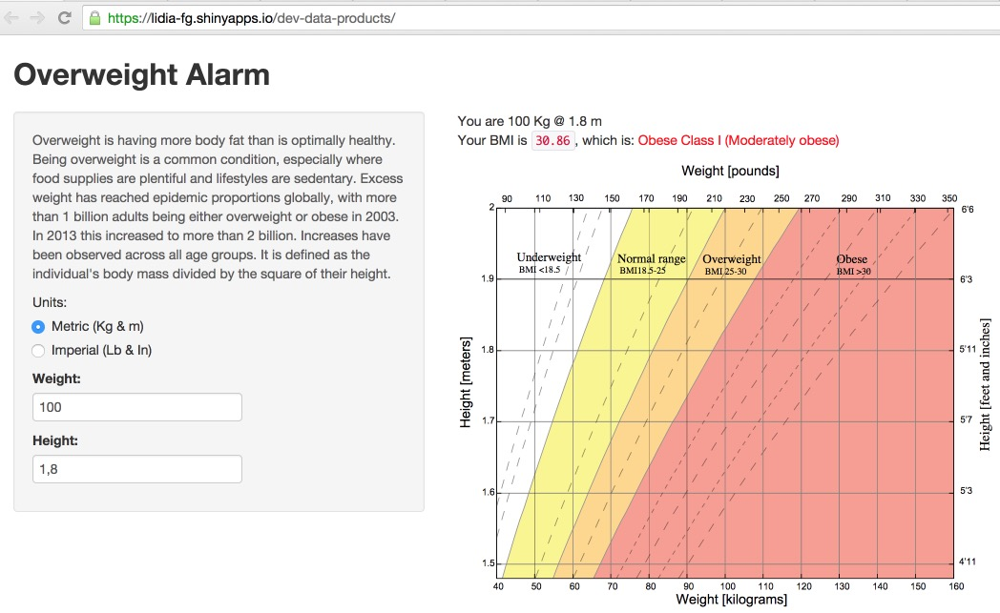

Overweight Alarm
========================================================
author: Lidia Fernandez Gago
date: 2014 Oct

What's this app about?
========================================================

The *Overweight Alarm* is simply an example of a Shiny app written for the `Developing Data Products` course. There is an instance of the app running - at least by the moment at [shinyapps.io](https://lidia-fg.shinyapps.io/dev-data-products/). 

The only thing to highlight about its code is that the index must be multiplied by 703 in case of dealing with imperial units. For instance, let's imagine that the input of the application was a 80Kg man aroud 1.90m.


```r
height = 1.90
weight = 80
weight / height^2 
```

```
[1] 22.16066
```

which, for what it's worth, represents a normal healthy weight.


The Body Mass Index
========================================================

### What's a BMI?

"The application is based on the calculation of the body mass index of a person, is a measure of relative weight based on an individual's mass and height. That measurement alone is enough to trigger overweight alarms.

Devised between 1830 and 1850 by the Belgian polymath Adolphe Quetelet during the course of developing 'social physics', it is defined as the individual's body mass divided by the square of their height ??? with the value universally being given in units of $kg/m2$."

### What does the BMI tell me?

"The BMI is used in a wide variety of contexts as a simple method to assess how much an individual's body weight departs from what is normal or desirable for a person of his or her height."


How to use the app
========================================================

1. The application [is running on shinyapps.io](https://lidia-fg.shinyapps.io/dev-data-products/)
2. Firstly, choose your units, either metric or imperial.
3. Provide your weight and height
4. The numbers on the right handside updates.


What the app looks like
========================================================


